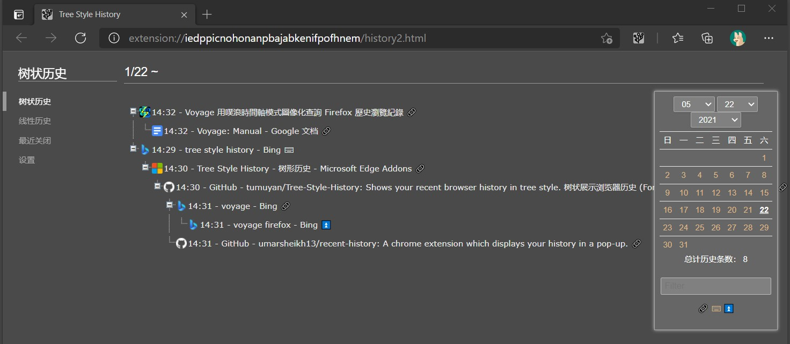

# Tree Style Histyle

 
 
 
  

This extension shows your recent browser history in tree style.  
When you browser pages from internet, you always jump from one page to another by clicking hyper-text links. This extension shows such a jumping relationship through a tree structure, help you find out what you were doing, what website you visited, and whether something has been done.  

Also following features are available.  
1. Use the right-click menu to quickly search the history for current site, or the site linked to.
2. Tree view of recently closed pages. They are group by when they were closed and whether they were closed properly. 
3. Linear view of bookmarks. Usually browser shows bookmarks in tree style, this extension does the opposite, reorders and displays bookmarks by time and site.  
4. Quickly switch tabs in popup page. Sort tabs in reverse order of the time you visited.

This work is based on [Recent History](https://github.com/umarsheikh13/recent-history) and has get the permission to modify and publish the code as a new exttension, many thanks to Umar.  
Currently only Chinese and English UI are available.  

The inspiration came from the Firefox extension [voyage](https://docs.google.com/document/d/1oaJjS9zWGQDBzy4wE403P7V2nQukMql_sfvAURl2noI/preview), which became obsolete when Firefox updated rapidly and its page was eventually removed.  
Since I never found a similar extension, I created this one to fulfill a long-standing wish.  
Based on Umar's [Recent History](https://github.com/umarsheikh13/recent-history) extension with permission from the original author to modify and publish as a new extension. Many thanks for his work and permission. 

## Policy  

Tree Style History collects your browser history, analyzes it and stores it on your computer, and shows it when needed.   
It does not upload data to the Internet or share it with other programs. When you uninstall the extension, all saved data will be automatically erased by the browser.  

## Install  
I have uploaded it to Edge Add-ons
https://microsoftedge.microsoft.com/addons/detail/gfmkhnaldbgcpoddmapciblllofekbpn  

I don't have Chrome Web Store developer account, but @oXnMe uploaded it to Chrome Web Store
https://chrome.google.com/webstore/detail/tree-style-history/khcenbpnhbeplojhaolbpldmoppicold  

Or download - unzip - load the folder in developer mode.  
https://github.com/tumuyan/Tree-Style-History/issues/1  

**Both Chrome and Edge require extensions adapt to Manifest V3, but I couldn't update this extension to Manifest V3, so this extension will soon become unusable.**

## Changelog

3.1.13 (2024/04/29) - Adjusted maximum number of items displayed in popup window, handled cases where favicon is empty.

3.1.12 (2022/06/23) - Added feature: Display recently browsed tabs in popup for quick tab switching; Optimized feature (recently closed tabs in popup): Data now retrieved from Chrome API, clicking restores session instead of opening webpage, closing window shows one record which directly restores window when clicked. 

3.1.11 (2022/06/11) - Modified option: Customize action after clicking icon; Adjusted right-click menu text, added toggle for showing right-click menu (#15).  

3.1.10 (2022/06/10) - Added feature: When clicking links in tree history, if a tab for this URL already exists, jump to the existing page instead of opening a new one (Also discovered during testing that browser requires upgrading manifest_version, tried but couldn't easily complete the update, hoping someone can help!).  

3.1.9 (2022/1/27) - Improved appearance of linear history and linear bookmarks: Added tooltip text for buttons, optimized time display, removed invalid checkboxes and invalid tooltip content from linear bookmarks, displayed number of bookmarks contained in domain categories of linear bookmarks.  

3.1.8 (2021/8/9) 增加选项：在“弹窗设置”中增加“显示弹窗”选项，选择是（弹窗）否（打开树状历史）  

3.1.7 (2021/6/24) 修复bug：在“最近关闭”的页面点击链接，会自动打开2个页面

3.1.6 (2021/6/7) Fixed bug: Chrome unable to display default history manager (works fine in Edge); Linear bookmarks unable to properly display bookmarklets.

3.1.5 (2021/5/29)  
3.1.5 (2021/5/29) - Added feature: Linear bookmarks tab. Added option: Specify whether to open browser default page or extension built-in page when clicking "More" in popup. Fixed bugs: Settings - wrong popup order when downloading parameters; dates not auto-padded with zeros. Known issue: Browser limits same extension to 4 shortcut keys maximum, now binding 5 shortcut keys through special method causes extension default shortcuts to not work, requiring manual setup.

3.1.4 (2021/5/22) - 增加功能：树状历史中显示较少的历史（默认关闭，需要在设置中手动打开），批量打开最近关闭的页面。优化：微调外观，一定程度上实现了窄窗口自适应(但是使用Android kiwi浏览器测试确认手机不能实现主要功能)，统一变更过滤域名的算法  

3.1.3 (2021/5/18) - 增加功能：树状展示最近关闭的页面；修复：令日期和时间选项对树状历史同样生效；优化：微调外观，修改设置中的默认参数。 

3.1.2 (2021/5/11) - 优化搜索浏览记录功能，增加选项同步功能（跟随浏览器账户自动同步），增加快捷键设置（可以通过设置快捷键替换默认历史记录管理器），缓存访问历史的网址数量，优化部分UI的样式和命名，增加清除缓存功能，优化网址过滤功能。

3.1.1 (2021/04/26) - 为树状历史页增加访问类型筛选功能，为树状历史增加loading动画/加大行间距，增加对网址标题特殊符号的处理，历史数量较少时自动载入前日记录，调整默认的设置参数，调整Chrome设置默认历史页面的选项（Edge屏蔽此功能），增加设置页的提示文字，优化历史缓存记录，降低搜索字数限制，增加暗黑模式（根据浏览器设置自动切换），调整popup页面外观，增加右键菜单“搜索此网站的浏览记录”。

3.1.0 (2021/04/18) - Add the basic tree style function.

## License  

Tree Style History, Tree Style History (Toolbar Icon)

Copyright (c) 2021 Tumuyan <tumuyan@gmail.com>
  
This Work is based on Recent History and has get the 
permission to modify and publish the code as a new exttension.
  
----

Recent History, Recent History (Toolbar Icon)

Copyright (c) 2011-2020 Umar Sheikh <hello@umarsheikh.co.uk>

THE EXTENSION IS PROVIDED IN THE HOPE THAT IT WILL BE USEFUL,
BUT WITHOUT ANY WARRANTY. IT IS PROVIDED "AS IS" WITHOUT
WARRANTY OF ANY KIND, EITHER EXPRESSED OR IMPLIED, INCLUDING,
BUT NOT LIMITED TO, THE IMPLIED WARRANTIES OF MERCHANTABILITY
AND FITNESS FOR A PARTICULAR PURPOSE.

IN NO EVENT UNLESS REQUIRED BY APPLICABLE LAW THE AUTHOR WILL
BE LIABLE TO YOU FOR DAMAGES, INCLUDING ANY GENERAL, SPECIAL,
INCIDENTAL OR CONSEQUENTIAL DAMAGES ARISING OUT OF THE USE OR
INABILITY TO USE THE PROGRAM (INCLUDING BUT NOT LIMITED TO LOSS
OF DATA OR DATA BEING RENDERED INACCURATE OR LOSSES SUSTAINED
BY YOU OR THIRD PARTIES OR A FAILURE OF THE PROGRAM TO OPERATE
WITH ANY OTHER PROGRAMS), EVEN IF THE AUTHOR HAS BEEN ADVISED
OF THE POSSIBILITY OF SUCH DAMAGES.

Attribution-Noncommercial-No Derivative Works 3.0 Unported
http://creativecommons.org/licenses/by-nc-nd/3.0/
